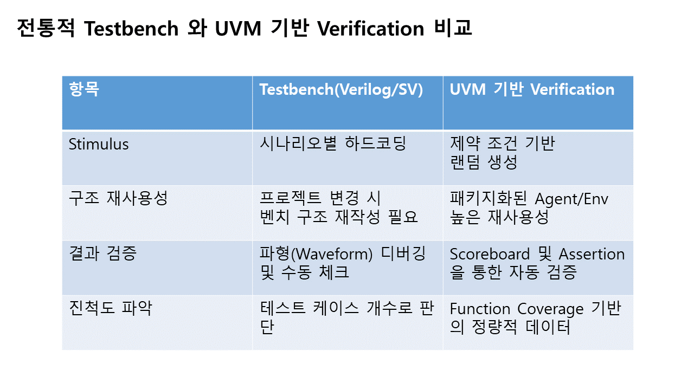
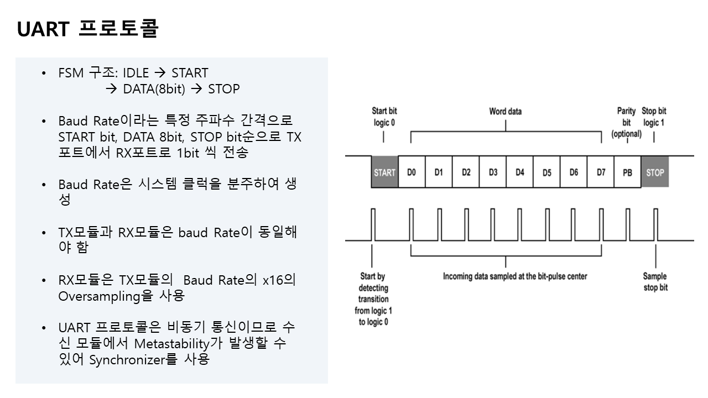
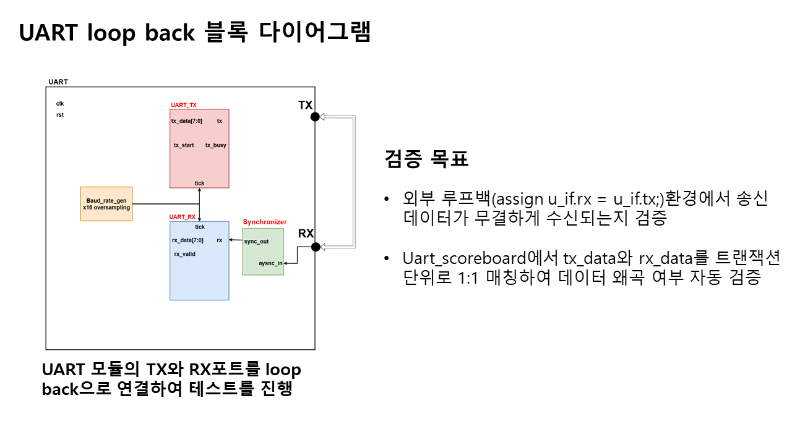
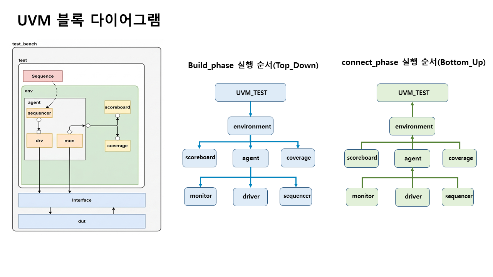
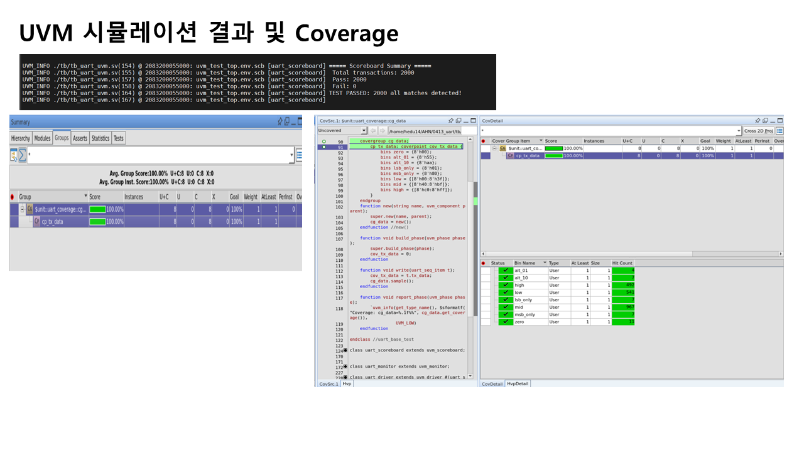

# UVM-Based UART IP Verification Project 🚀

본 프로젝트는 비동기 시리얼 통신 프로토콜인 UART(Universal Asynchronous Receiver/Transmitter) IP Core를 RTL로 설계하고, **UVM(Universal Verification Methodology)**을 활용하여 재사용 가능하고 자동화된 검증 환경을 구축한 포트폴리오입니다.

---

## 1. Verification Methodology (검증 방법론)

기존 Directed Testbench의 한계를 극복하고 검증 효율을 극대화하기 위해 UVM을 도입했습니다[cite: 14].

* **Constrained Random:** 하드코딩 방식에서 벗어나 제약 조건 기반의 랜덤 생성을 통해 수많은 시나리오를 자동으로 검증합니다[cite: 14].
* **Reusability:** Agent 및 Env를 패키지화하여 높은 재사용성을 확보했습니다[cite: 14].
* **Automation:** 파형(Waveform) 디버깅에 의존하지 않고 Scoreboard를 통한 자동 검증(Self-Checking)을 구현했습니다[cite: 14].

---

## 2. DUT Architecture & UART Protocol

단일 시스템 클럭을 기반으로 9600 bps의 속도를 가지는 UART 통신 모듈을 설계했습니다.

* **Protocol FSM:** `IDLE` $\rightarrow$ `START` $\rightarrow$ `DATA` (8bit) $\rightarrow$ `STOP` 순으로 상태가 천이됩니다[cite: 14].
* **Baud Rate Generator (`baud_rate_gen.sv`):** 시스템 클럭을 분주하여 타겟 클럭(Tick)을 생성합니다[cite: 14, 16]. 수신(RX) 시 신호 왜곡을 방지하기 위해 16x Oversampling 기법을 적용했습니다[cite: 14].
* **2-Stage Synchronizer (`sync_2ff.sv`):** UART는 비동기 통신이므로, 수신 모듈(`uart_rx`) 최전단에 동기화기를 배치하여 메타스테빌리티(Metastability) 발생을 원천 차단했습니다[cite: 14, 16].

---

## 3. Verification Strategy & Loopback Environment

* **Loopback 결선:** DUT 모듈 내부를 오염시키지 않고, Testbench 최상위 환경(`tb_uart_uvm.sv`)에서 물리적인 외부 루프백(`assign u_if.rx = u_if.tx;`)을 구성하여 검증을 진행했습니다[cite: 14, 15].
* **검증 목표 (Data Integrity):** TX 모듈에서 송신한 데이터가 무결하게 RX 모듈로 수신되는지 확인합니다[cite: 14]. `uart_scoreboard`에서 트랜잭션 단위로 1:1 자동 매칭을 수행하여 데이터 왜곡 여부를 판별합니다[cite: 14].

---

## 4. UVM Testbench Architecture

표준 UVM 계층 구조를 적용하여 Top-Down 방식의 `build_phase`와 Bottom-Up 방식의 `connect_phase`를 구현했습니다[cite: 14].

* **Sequence & Item (`uart_seq_item`, `uart_rand_seq`):** 유효 데이터 범위 내에서 랜덤 데이터를 생성하여 트랜잭션을 발생시킵니다[cite: 15].
* **Driver (`uart_driver`):** `fork...join` 구문을 통해 TX 데이터 전송 상태와 RX 수신 감시를 동시에(Concurrent) 처리하여 펄스 유실을 방지합니다[cite: 15].
* **Monitor (`uart_monitor`):** Interface 포트를 감시하여 송수신이 완료된 데이터를 패킷화한 뒤 Analysis Port(`ap`)를 통해 브로드캐스팅합니다[cite: 15].
* **Scoreboard (`uart_scoreboard`):** Monitor로부터 받은 `tx_data`와 `rx_data`를 실시간으로 비교하고, Pass/Fail 카운트를 집계합니다[cite: 15].

---

## 5. Simulation Results & Coverage

기능적 커버리지(Functional Coverage)를 모델링하여 정량적인 검증 종료 조건을 확보했습니다[cite: 14].

* **Coverage Bins (`uart_coverage`):** 하드웨어의 결함을 효과적으로 찾아내기 위해 8개의 핵심 바구니(Bins)를 설계했습니다[cite: 15].
  * **Worst-case Toggle:** `8'h55`, `8'hAA` (최대 주파수 토글 스트레스 환경)[cite: 15].
  * **Boundary Case:** `8'h00` (All Zero), `8'h01` (LSB Only), `8'h10` (MSB Only)[cite: 15].
  * **Data Distribution:** `low`, `mid`, `high` 영역의 균등 분포 검증[cite: 15].
* **Simulation Result:** 총 2,000회의 트랜잭션을 발생시켜 100% 매칭(Mismatch 0건) 및 모든 Coverage Bins 100% 달성에 성공했습니다[cite: 14].